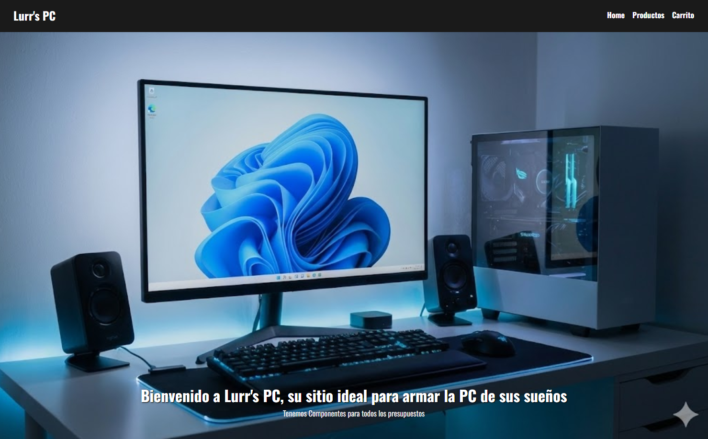
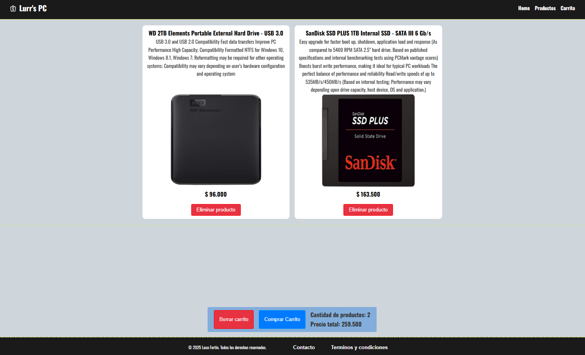

# 🛒 E-Commerce - Talento Tech

 

> Proyecto final desarrollado para el bootcamp de **Talento Tech**. Una simulación de tienda en línea moderna, responsiva y funcional.

## 🔗 Demo en Vivo
Prueba la aplicación a traves de este enlace:
 **[Web del proyecto](https://lucaffortin.github.io/e-commerce-talento-tech/)**

---

## 📸 Capturas de Pantalla

| Home Page | Carrito de Compras |
|:---:|:---:|
|  |  |
*(Reemplaza estos links con las rutas de tus propias imágenes, ej: `./assets/screenshot1.png`)*

---

## 💻 Tecnologías Utilizadas

Este proyecto fue construido utilizando las siguientes herramientas y tecnologías:

* **Frontend:**
    *  **HTML5**: Estructura semántica.
    *  **CSS3**: Diseño responsivo y animaciones.
    *  **JavaScript (ES6+)**: Lógica del carrito, filtrado y DOM.
* **Herramientas:**
    *  **Git & GitHub**: Control de versiones.
    * **VS Code**: Editor de código.

---

## ✨ Funcionalidades Principales

El usuario puede realizar las siguientes acciones en la tienda:

- [x] **Visualización de Productos:** Catálogo dinámico generado con JavaScript.
- [x] **Carrito de Compras:** Agregar, eliminar y vaciar productos.
- [x] **Cálculo de Total:** Suma automática de precios en tiempo real.
- [x] **Persistencia de Datos:** El carrito no se borra al recargar la página (LocalStorage).
- [x] **Diseño Responsivo:** Adaptable a móviles, tablets y escritorio.
- [ ] **Pasarela de Pagos:** (Próximamente).

---

## 🔧 Instalación y Uso Local

Si deseas correr este proyecto en tu computadora, sigue estos pasos:

1. **Clona el repositorio:**
   ```bash
   git clone [https://github.com/LucaFFortin/e-commerce-talento-tech.git](https://github.com/LucaFFortin/e-commerce-talento-tech.git)

2. **Navega a la carpeta del proyecto:**
   ```bash
   cd e-commerce-talento-tech

3. **Ejecuta el proyecto:**
   Simplemente abre el archivo index.html en tu navegador web favorito.
   O usa la extensión "Live Server" en VS Code.

--

## 📂 Estructura del Proyecto

e-commerce-talento-tech/
├── images/          # Imágenes y recursos estáticos
├── pages/           # Paginas de la tienda
    └── Carrito/     # Carrito de la tienda
    └── Contacto/    # Formulario de contacto
    └── Terminos/    # Terminos y condiciones
├── styles.css       # Hoja de estilos principal
├── script.js        # Lógica de la tienda
├── index.html       # Página principal
├── LICENCE          # Licencia del Software
└── README.md        # Documentación


--

## ✒️ Autor: Luca Fortin

💼 LinkedIn: [Luca Fortin](https://www.linkedin.com/in/fortin-luca/)

🐙 GitHub: @LucaFFortin

📧 Email: Luca.f.fortin@gmail.com

Made with 💜 for Talento Tech.
